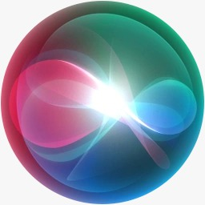

# **Asistente de voz  siri**
- **Historia de Siri**: Siri se introdujo por primera vez en 2011 con el iPhone 4S y ha evolucionado desde entonces.

- **Funciones de Siri**: tiene una variedad de tareas, como enviar mensajes, realizar llamadas, proporcionar información sobre el clima, dar direcciones, etc.

- **Integración con el ecosistema de Apple**: Siri está diseñado para funcionar de manera integrada con otros productos de Apple, como el HomePod, el Apple Watch y los AirPods.

