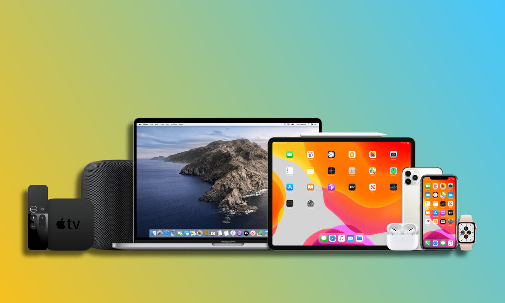

# **Precios de los equipos**
Los precios de los dispositivos iOS varían según el modelo, la capacidad de almacenamiento entre otras diferentes características, algunos ejemplos serían:
- **iPhone**: Los precios de los iPhones pueden variar desde modelos accesibles como el Iphone SE que su precio esta entre los $3000 o $4000, hasta el Iphone 14 pro, donde su precio ronda entre los $26000 mexicanos.
- **iPad**: Los iPads también tienen una variedad de modelos y precios, desde alguna ipad de 9na generación que estaria entre los $6000, hasta un Ipad Pro que puede estar en $29000, tambien depende de  las pulgadas de estas.
- **Otros dispositivos iOS**: Los precios de dispositivos como el Apple Watch o las computadoras Macs, tambien varian dependiendo de las características antes mencionadas.

